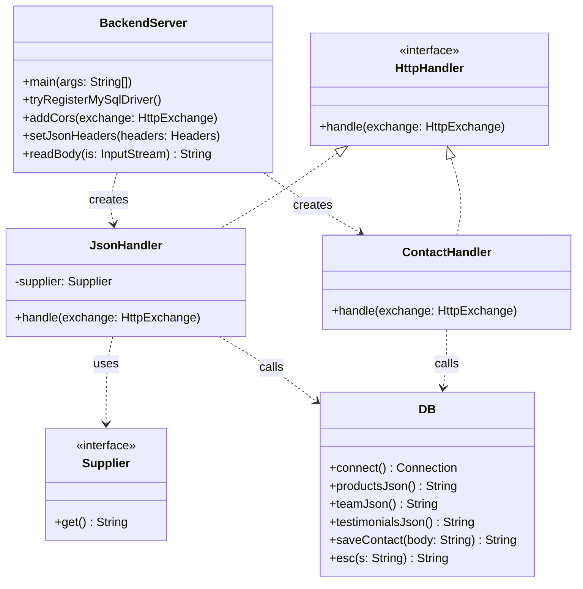
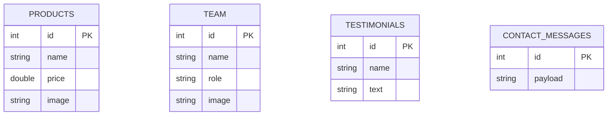
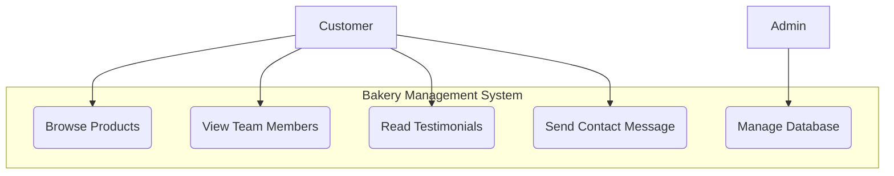
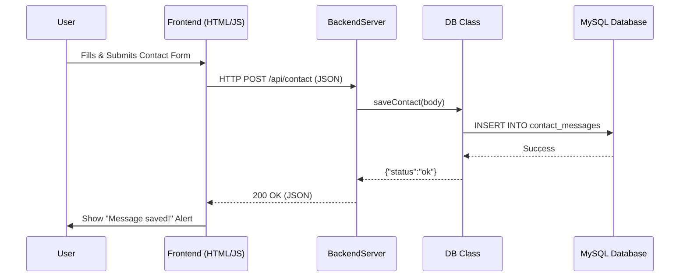
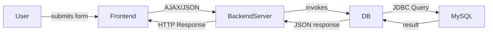
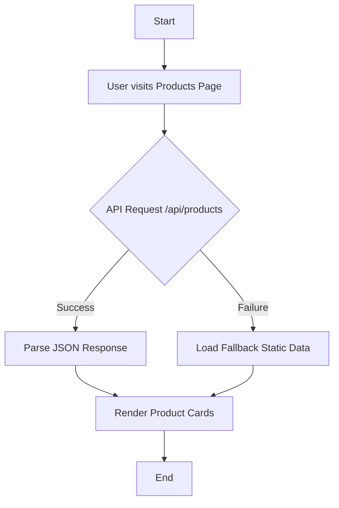
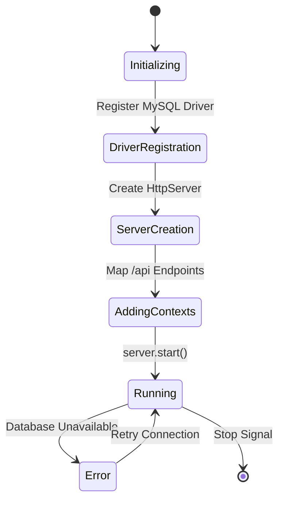
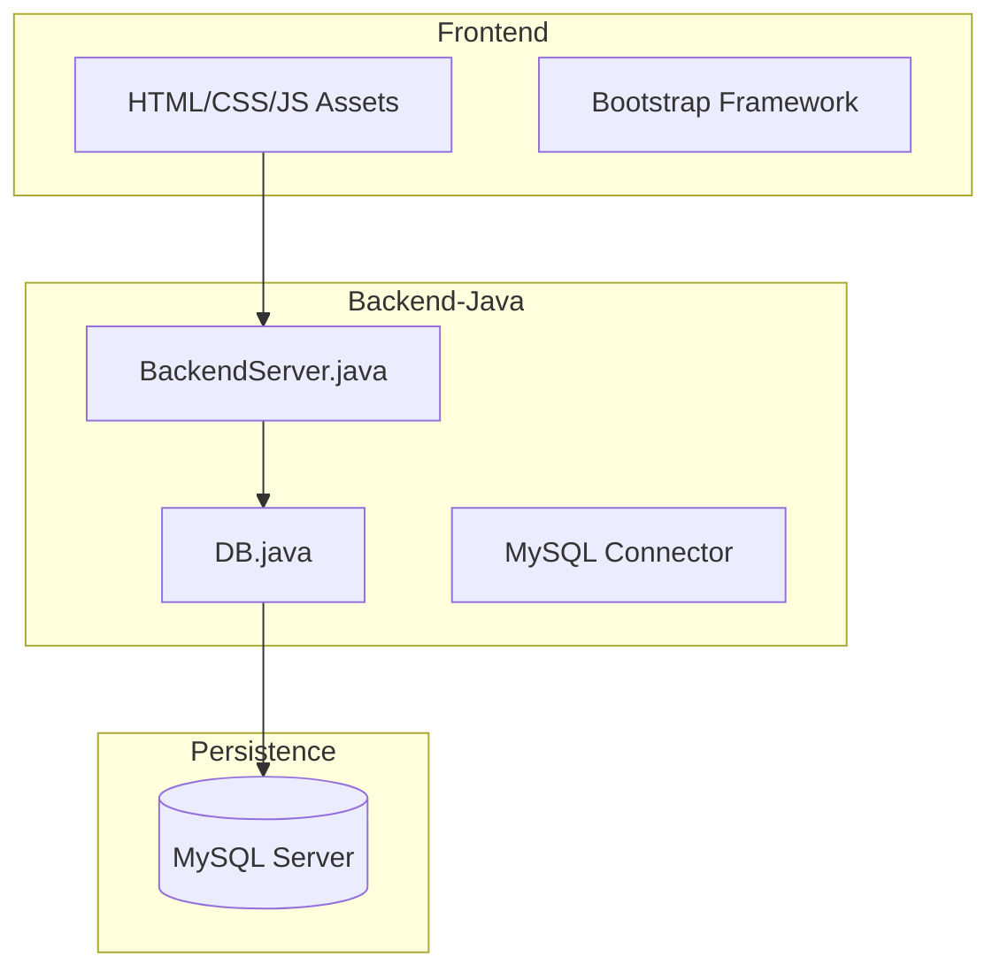
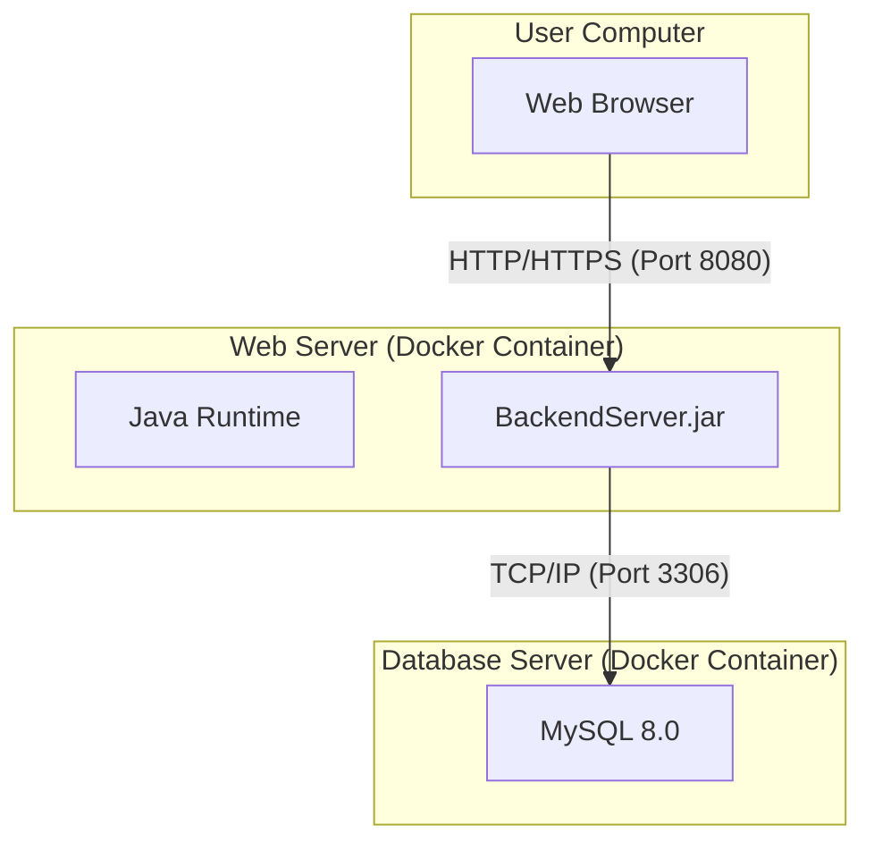

# Bakery Management Project - UML Diagrams

This document contains all the UML diagrams for the Bakery Management Project, including architecture, data models, and behavioral workflows.

---

## 1. Class Diagram


---

## 2. ER Diagram


---

## 3. Use Case Diagram


---

## 4. Sequence Diagram


---

## 5. Collaboration Diagram


---

## 6. Activity Diagram


---

## 7. State Chart Diagram


---

## 8. Component Diagram


---

## 9. Deployment Diagram


---

## 10. Package Diagram
```mermaid
graph TB
    subgraph "Root"
        R1[HTML Files]
        R2[Docker Config]
    end

    subgraph "Assets"
        A1[css]
        A2[js]
        A3[img]
        A4[lib]
    end

    subgraph "Backend"
        subgraph "src"
            S1[BackendServer]
            S2[DB]
        end
        subgraph "lib"
            L1[mysql-connector]
        end
    end

    R1 -.-> A1
    R1 -.-> S1
